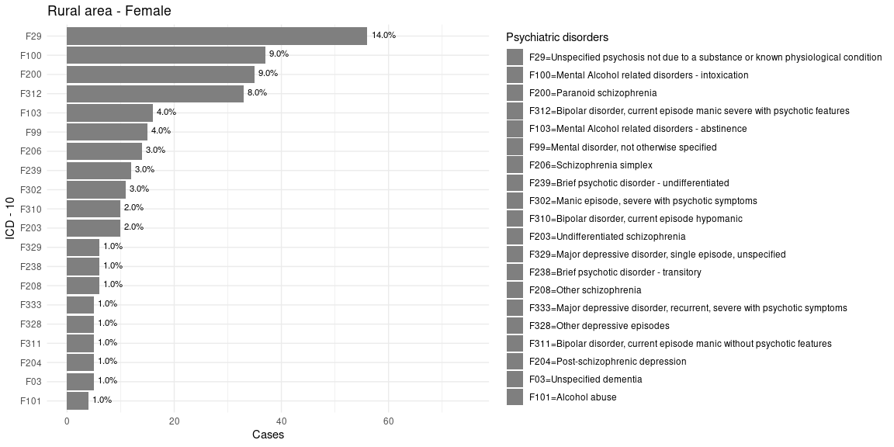
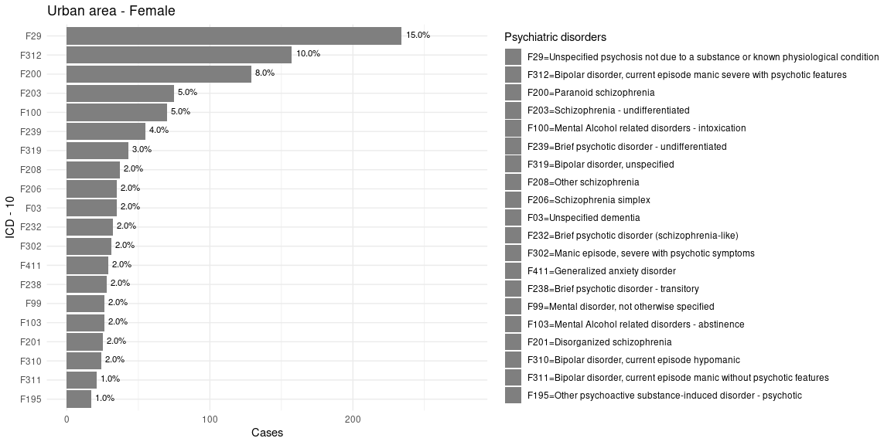
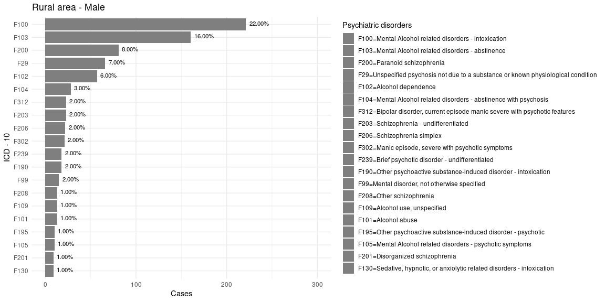
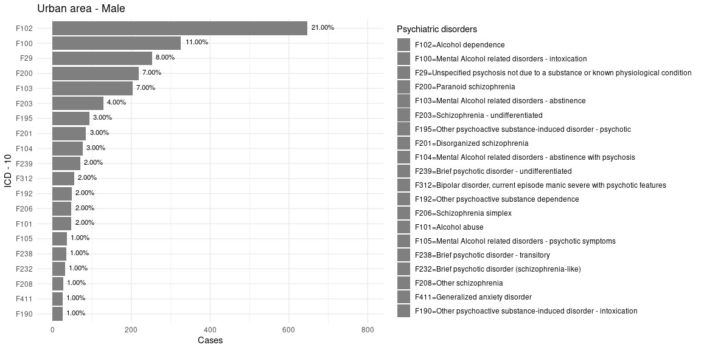

```{r setup, include=FALSE}
dep <- function(x) {
  if (!all(x %in% installed.packages())) {
    install.packages(x[x %in% installed.packages()[, "Package"] == F])
  }
  lapply(x, require, character.only = T)
}


dep(c(
  "qrencoder", "knitr"
))

knitr::opts_chunk$set(echo = FALSE)
setwd(here::here())
```

# Introduction

- Multimorbidity (MM) is associated with great burden of the health system

- People with mental disorders (MD) have a high prevalence of MM in addition to worse quality of life, more treatment costs and premature death [@kilbourneImprovingPhysicalHealth2017]

- Half of the world's population lives in urban areas and is expected to grow to 68% by 2050 [@whoUrbanHealth2021]

- Urban areas have density. pop. greater social instability and consequently higher prevalence of violence, pollution and noise[@peenCurrentStatusUrbanrural2010]

# Specific Conditions

* Mood disorders: Heterogeneous Results
  * Major depresion twice as frequent in urban areas after controlling for socioeconomic variables[@blazerPsychiatricDisordersRural1985]
  * Canadian study found no difference in incidence[@parikhMoodDisordersRural1996]
  * Study with results grouped in first world countries, higher incidence in urban areas[@peenCurrentStatusUrbanrural2010]
* Schizophrenia and Psychosis
  * Linear growth in incidence with urbanization and 2.37 times greater risk of psychosis[@vassosMetaAnalysisAssociationUrbanicity2012]

# Specific Conditions

- Substance use:
  - No difference in prevalence in pooled results collected in first world countries[@peenCurrentStatusUrbanrural2010]

  - Higher consumption of alcoholic beverages in urban areas but similar incidence of alcohol dependence among urban and rural residents of the US[@dixonAlcoholUsePatterns2016]

- Most of the world's population lives in low-income countries and in these countries [@whoUrbanHealth2021], urbanization in these countries was faster and more chaotic in a specific political and social context[@montgomeryUrbanTransformationDeveloping2008a]

# Aim

- To compare psychiatric hospitalizations between residents of urban and rural areas in a large population, contributing to fill the gap in studies in this area in low-income countries


## Methods

- Observational, cross-sectional study with administrative data of hospital admissions in cities in the state of Bahia in Brazil from 01/2008 to 03/2017. Data were linked to Cadastro Unico (Brazilian register with all beneficiaries of any social support in the country).

- 399 cities were included (out of 415)

- 6176 adults were admitted for psychiatric treatment from 2008 to 2017

# Table 1

\tiny
|                                                                      | Overall           | Rural             | Urban             | P-value  |
|----------------------------------------------------------------------|-------------------|-------------------|-------------------|----------|
|                                                                      | (N=6176)          | (N=1399)          | (N=4546)          |          |
| **Sex**                                                              |                   |                   |                   |  0.00144 |
| Male                                                                 | 4135 (67.0%)      | 990 (70.8%)       | 3007 (66.1%)      |          |
| Female                                                               | 2041 (33.0%)      | 409 (29.2%)       | 1539 (33.9%)      |          |
| **Race/Color**                                                       |                   |                   |                   |  <0.001  |
| White                                                                | 557 (9.0%)        | 171 (12.2%)       | 382 (8.4%)        |          |
| Black                                                                | 5076 (82.2%)      | 1109 (79.3%)      | 3884 (85.4%)      |          |
| Yellow/asian                                                         | 21 (0.3%)         | 5 (0.4%)          | 15 (0.3%)         |          |
| Indigenous                                                           | 10 (0.2%)         | 3 (0.2%)          | 6 (0.1%)          |          |
| **Educational Level**                                                |                   |                   |                   |  <0.001  |
| Never attended                                                       | 1074 (17.4%)      | 319 (22.8%)       | 753 (16.6%)       |          |
| Pre-school                                                           | 27 (0.4%)         | 10 (0.7%)         | 17 (0.4%)         |          |
| Reading ability                                                      | 71 (1.1%)         | 27 (1.9%)         | 44 (1.0%)         |          |
| Elementary school  I                                                 | 2171 (35.2%)      | 597 (42.7%)       | 1569 (34.5%)      |          |
| Elementary school  II                                                | 1369 (22.2%)      | 230 (16.4%)       | 1129 (24.8%)      |          |
| High school                                                          | 566 (9.2%)        | 60 (4.3%)         | 500 (11.0%)       |          |
| Graduate level                                                       | 14 (0.2%)         | 2 (0.1%)          | 12 (0.3%)         |          |
| **Age**                                                              |                   |                   |                   |  0.667   |
| Mean (SD)                                                            | 37.6 (12.6)       | 37.6 (12.9)       | 37.8 (12.4)       |          |
| Length of hospital stay                                              |                   |                   |                   |  <0.001  |
| Mean (SD)                                                            | 17.6 (35.8)       | 11.4 (17.4)       | 19.4 (40.1)       |          |:w
: Main clinical and demographic characteristics of patients with hospital admittance for psychiatric disorders of the sample. Group comparison was performed using chi-2 tests for the categorical variables and ANOVA for the continuous variables.


# Table 1

\tiny
|                                                                      | Overall           | Rural             | Urban             | P-value  |
|----------------------------------------------------------------------|-------------------|-------------------|-------------------|----------|
| **Reasons for permanence in hospital**                               |                   |                   |                   |  <0.001  |
| Permanence due to complication                                       | 42 (0.7%)         | 14 (1.0%)         | 26 (0.6%)         |          |
| Permanence due to social or family impossibility                     | 5179 (83.9%)      | 1225 (87.6%)      | 3750 (82.5%)      |          |
| Permanence due to process for organ donation                         | 302 (4.9%)        | 40 (2.9%)         | 254 (5.6%)        |          |
| Permanence due to change in procedure                                | 7 (0.1%)          | 1 (0.1%)          | 5 (0.1%)          |          |
| Permanence due to re-operation                                       | 117 (1.9%)        | 13 (0.9%)         | 102 (2.2%)        |          |
| Transference to home admissions                                      | 18 (0.3%)         | 6 (0.4%)          | 11 (0.2%)         |          |
| Transference to other facility                                       | 134 (2.2%)        | 17 (1.2%)         | 114 (2.5%)        |          |
| Death with declaration provided by the  assistant physician          | 150 (2.4%)        | 18 (1.3%)         | 127 (2.8%)        |          |
| Death with declaration provided by the Coroners Office               | 10 (0.2%)         | 1 (0.1%)          | 9 (0.2%)          |          |
| Death with declaration provided by the Service of death verification | 49 (0.8%)         | 15 (1.1%)         | 32 (0.7%)         |          |
| Discharge of puerperal woman/mother and permanence of newborn        | 10 (0.2%)         | 0 (0%)            | 10 (0.2%)         |          |
| Discharge of puerperal woman/ mother and stillbirth                  | 1 (0.0%)          | 1 (0.1%)          | 0 (0%)            |          |
| Death of puerperal woman/ mother and newborn                         | 79 (1.3%)         | 28 (2.0%)         | 49 (1.1%)         |          |
| **Marital Status**                                                   |                   |                   |                   |  <0.001  |
| Single                                                               | 3699 (59.9%)      | 842 (60.2%)       | 2797 (61.5%)      |          |
| Married                                                              | 605 (9.8%)        | 226 (16.2%)       | 372 (8.2%)        |          |
| Divorced                                                             | 10 (0.2%)         | 3 (0.2%)          | 7 (0.2%)          |          |
| Separated                                                            | 77 (1.2%)         | 13 (0.9%)         | 64 (1.4%)         |          |
| Widow                                                                | 41 (0.7%)         | 8 (0.6%)          | 32 (0.7%)         |          |
: Main clinical and demographic characteristics of patients with hospital admittance for psychiatric disorders of the sample. Group comparison was performed using chi-2 tests for the categorical variables and ANOVA for the continuous variables.

# Table 1 - Diagnostic blocks

\tiny
|                                                                      | Overall           | Rural             | Urban             | P-value  |
|----------------------------------------------------------------------|-------------------|-------------------|-------------------|----------|
| F00-F09 Organic, Including Symptomatic, Mental Disorders             | 214 (3.5%)        | 30 (2.1%)         | 177 (3.9%)        |          |
| F10-F19 Mental And Behavioral Disorders Due To Substance Use         | 2712 (43.9%)      | 685 (49.0%)       | 1939 (42.7%)      |          |
| F20-F29 Schizophrenia, Schizotypal And Delusional Disorders          | 2210 (35.8%)      | 440 (31.5%)       | 1686 (37.1%)      |          |
| F30-F39 Mood [Affective] Disorders                                   | 719 (11.6%)       | 171 (12.2%)       | 512 (11.3%)       |          |
| F40-F48 Neurotic, Stress Related And Somatoform Disorders            | 121 (2.0%)        | 22 (1.6%)         | 90 (2.0%)         |          |
| F50-F59 Behavioral. Syndrome. Associated with Physical Factors       | 23 (0.4%)         | 4 (0.3%)          | 18 (0.4%)         |          |
| F60-F69 Disorders Of Adult Personality And Behavior                  | 48 (0.8%)         | 8 (0.6%)          | 38 (0.8%)         |          |
| F70-F79 Mental Retardation                                           | 46 (0.7%)         | 8 (0.6%)          | 37 (0.8%)         |          |
| F80-F89 Disorders of Psychological Development                       | 3 (0.0%)          | 0 (0%)            | 2 (0.0%)          |          |
| F90-F98 Behavioral Disorders With Onset In Childhood                 | 8 (0.1%)          | 1 (0.1%)          | 6 (0.1%)          |          |
| F99 Unspecified Mental Disorder.                                     | 72 (1.2%)         | 30 (2.1%)         | 41 (0.9%)         |          |
| **Hospitalization - days**                                           |                   |                   |                   | 0.001    |
| Mean (SD)                                                            | 1.63 (1.75)       | 1.34 (0.982)      | 1.72 (1.94)       |          |
: Main clinical and demographic characteristics of patients with hospital admittance for psychiatric disorders of the sample. Group comparison was performed using chi-2 tests for the categorical variables and ANOVA for the continuous variables.

# Diagnostic frequencies: Rural females x urban 
:::::::::::::: {.columns}
::: {.column width="50%"}

```{r out.width='100%', fig.align='center', fig.cap='Women - rural'}

```

:::
::: {.column width="50%"}

```{r out.width='100%', fig.align='center', fig.cap='Women - urban'}

```

:::
::::::::::::::


# Diagnostic frequencies: Rural x Urban males

:::::::::::::: {.columns}
::: {.column width="50%"}

```{r out.width='100%', fig.align='center', fig.cap='Men - rural'}

```

:::
::: {.column width="50%"}

```{r out.width='100%', fig.align='center', fig.cap='Men - urban'}

```

:::
::::::::::::::

# Discussion

- Intoxication Acute alcohol abuse was the 2nd cause of hospitalization for rural women (9%) and the 5th cause for urban women

- 3% incidence of abuse and 9% dependence in the Brazilian population in Brazil [@laranjeiraAlcoholUsePatterns2009]

- AUD related to low income and close incidence in rural and urban areas in Brazil [@laranjeiraAlcoholUsePatterns2009]

- In the study Transt. for alcohol use were the most frequent diagnoses among urban and rural men

- Previous epi study in Salvador showed a higher risk of harmful use of alcohol among individuals with higher income and educational level [@almeida-filhoAlcoholDrinkingPatterns2004]

- **Therefore our finds diverge to what was reported in the past. Trends have changed?**


# Discussion

- F10-F19 ICD-10 had more subsequent hospitalizations for medical diseases (68%) and mainly for hypertension and cirrhosis of the liver caused by alcohol.

## Conclusions

- Huge burden of alcohol abuse and alcohol consumption on the public health system, with  direct  (intoxication, withdrawal symptoms) and indirect clinical consequences.

- High alcohol use among rural women.

# Funding

- Medical Research Council - UK
  - Grant no. MC_PC_MR/T03355X/1


## Contato 

```{r qr, out.width='80%', fig.align='center'}
include_graphics("/home/luis/Documents/OneDrive/Aulas/vcu-rmarkdown-beamer-template (copy)/src/style/qr_lf_araujo.png")
```


